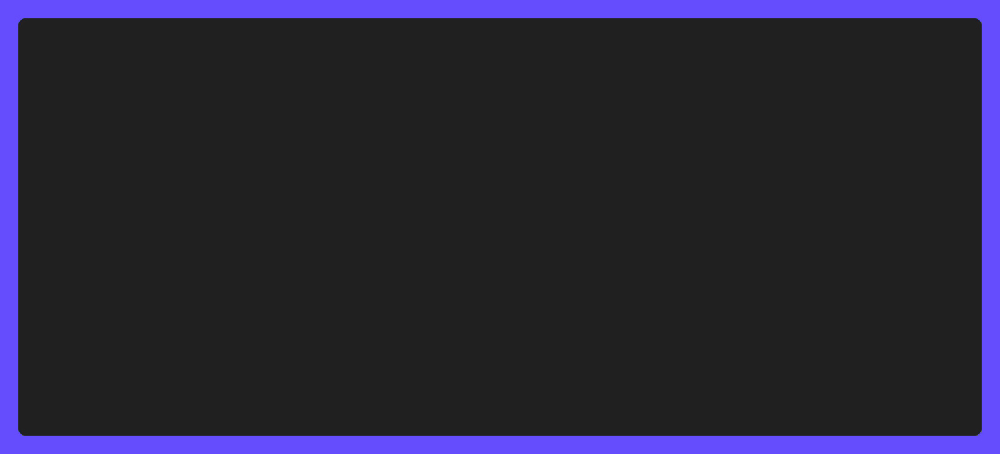

<!-- template:define:options
{
  "nodescription": true
}
-->

---

`go-nf` is a Go package that provides a type-safe way to access Nerd Font glyphs.

<!-- template:begin:header -->
<!-- do not edit anything in this "template" block, its auto-generated -->

  
  

  

  

  
  

  
  
  
  
  

<!-- template:end:header -->

<!-- template:begin:toc -->
<!-- do not edit anything in this "template" block, its auto-generated -->
<!-- template:end:toc -->

## :sparkles: Features

> [!WARNING]
> The scope and design of this module is still a work in progress, and may change
> before it is considered stable, and a `v1.0.0` release is made.

- :heavy_check_mark: Reference Nerd Font glyphs by their name, rather than hardcoding
  them as strings in your project. Ensures type safety, validation, and better
  documentation.
- :heavy_check_mark: Split into multiple packages, per Nerd Font class, to reduce
  binary size and improve organization.
- :heavy_check_mark: Detect if Nerd Fonts are installed on the system, to prevent
  using glyphs that are not available.
  - Note that this is not a perfect solution. Just because Nerd Fonts are installed,
    doesn't mean the font in question is actively being used in the associated
    terminal emulator.
- :heavy_check_mark: Helpers for iterating over all glyphs, by class, ID, and more.
  - Note that using the `all` package will result in all glyphs being bundled into
    your binary, which may increase the size of your binary (500kb-1MB, without
    additional debug-symbols stripping).

---

## :gear: Usage

<!-- template:begin:goget -->
<!-- template:end:goget -->

## :clap: Examples

### Simple example

- Static glyph references and dynamic lookup by file extension.
- [Example source](./_examples/simple/main.go)

### Package manager example

- Bubble Tea TUI simulating package installation with glyphs per package type.
- [Example source](./_examples/package-manager/main.go)

---

<!-- template:begin:support -->
<!-- do not edit anything in this "template" block, its auto-generated -->
<!-- template:end:support -->

<!-- template:begin:contributing -->
<!-- do not edit anything in this "template" block, its auto-generated -->
<!-- template:end:contributing -->

<!-- template:begin:license -->
<!-- do not edit anything in this "template" block, its auto-generated -->
<!-- template:end:license -->
